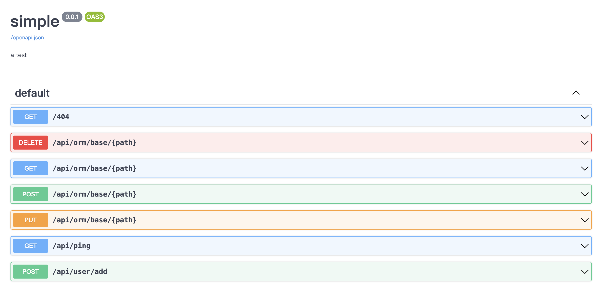

## RBAC（Role-Based Access Control）

基于 角色 的权限控制 用户 -> 角色 -> 权限

- RBAC0模型, 很多产品基于该模型就已经能满足设计需求。用户和角色之间可以是一对多也可以是多对多关系，而角色和权限之间则多以多对多的关系为主，用户拥有的权限等于他所有的角色持有的权限之和。
- RBAC1模型, RBAC0 的升级版，它对角色这层元素上进行了细分，引入继承的概念，也就是可以继承某个基础角色生成子角色。
- RBAC2 模型, 对角色层面增加了更多的限制：
  - 静态职责分离 SSD
    - 角色互斥：相同用户不能同时拥有互斥关系的角色，例如会计和出纳两个角色就是互斥的
    - 基数约束：角色被分配到的用户有数量上限，例如公司中只有一个 CEO 职位，那么这个角色的数量就是有限的
    - 先决条件角色：要拥有更高级别的角色权限，需要先获取到相对来说低级别的一些权限，例如副经理要想获取到总监级别权限，那么他需要先获取到经理级别的权限
  - 动态职责分离 DSD
    - 动态的限制用户及其拥有的角色，例如一个用户可以同时拥有两个角色，但是运行时只能激活一个角色
- RBAC3 模型, RBAC1 + RBAC2 两个模型的合集，所以 RBAC3 既有 RBAC1 的角色等级划分，也有 RBAC2 的角色限制。

> 该项目采用`RBAC0`模型

## 数据表定义

查看migrations文件夹中的sql内容

- users 表：存储用户信息。
- roles 表：存储角色信息。
- permissions 表：存储权限信息。
- user_roles 表：实现用户和角色之间的多对多关系。
- role_permissions 表：实现角色和权限之间的多对多关系。

为用户分配多个角色, 为角色分配多个权限, 通过用户的角色来确定用户的权限

## screenshot



- 数据查询: [get]/api/orm/base/数据表?查询字段=值 不带查询字段就是获取表中所有数据
- 数据删除: [delete]/api/orm/base/数据表 jsonbody
- 数据新增: [put]/api/orm/base/数据表 jsonbody
- 数据修改: [post]/api/orm/base/数据表?查询字段=值 jsonbody

## 前端

```bash
openssl genrsa -out private.pem 2048

openssl rsa -in private.pem -pubout -out public.pem

openssl rsa -in public.pem -pubin -outform PEM -pubout -out public_spki.pem
```

```bash
pnpm i

pnpm dev
```